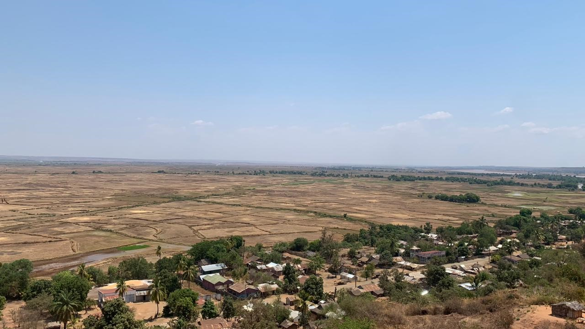
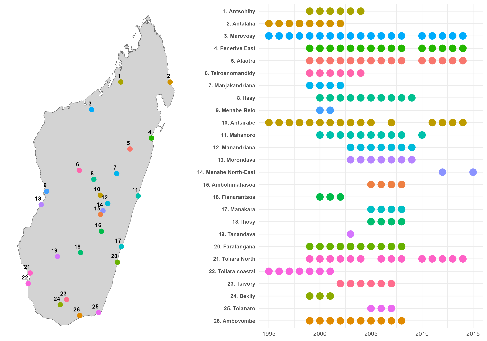

# Introduction {.unnumbered}

::: {.content-visible when-format="html"}

::: {.content-hidden when-profile="marovoay"}
, via [Wikimedia Commons](https://commons.wikimedia.org/wiki/File:Rizi%C3%A8re_d%27alaotra_Mangoro.jpg).](images/cover.jpg){fig-alt="Vue aérienne d'une rizière dans la région d'Alaotra Mangoro, Madagascar."}
:::

::: {.content-hidden when-profile="alaotra"}
::: {.content-hidden when-profile="consolidated"}
{fig-alt="Plaine de Marovoay."}
:::
:::

:::

Les observatoires ruraux constituent un dispositif original de collecte de données longitudinales mis en place à Madagascar à partir de 1995 afin de documenter les conditions de vie des ménages ruraux et leurs dynamiques dans le temps. Reposant sur des enquêtes répétées auprès des mêmes localités, ils combinent des questionnaires ménages standardisés et des enquêtes communautaires qualitatives, permettant d’articuler analyse statistique et compréhension fine des contextes locaux.

::: {.content-visible when-profile="consolidated"}
Entre 1995 et 2015, ce dispositif a couvert 26 zones contrastées, reflétant la diversité des systèmes agraires, des environnements écologiques et des contraintes socio-économiques du pays. Les données produites documentent de manière détaillée la composition des ménages, leurs activités, leurs revenus, leurs pratiques agricoles, ainsi que les transformations des économies rurales sur plus de deux décennies.

{fig-alt="Carte historique des observatoires ruraux à Madagascar."}
:::

La campagne 2025 s’inscrit dans cette continuité tout en introduisant des évolutions méthodologiques. Elle repose sur une articulation étroite entre enquêtes quantitatives auprès des ménages et enquêtes communautaires visant à documenter les contextes locaux (pratiques agricoles, accès aux intrants, sécurité, gouvernance locale). Les protocoles de terrain intègrent également des exigences renforcées en matière d’éthique, de consentement éclairé et d’interaction avec les autorités locales à différents niveaux administratifs.

Dans le cadre du projet BETSAKA, ce dispositif est aujourd’hui réactivé afin d’analyser les effets de long terme des politiques de conservation, en particulier des aires protégées, sur les conditions de vie des populations et les dynamiques environnementales. Le projet s’appuie sur une combinaison de données historiques, d’images satellitaires et de nouvelles enquêtes de terrain pour étudier conjointement déforestation, feux et trajectoires socio-économiques.

::: {.content-visible when-profile="consolidated"}
Ce document présente le traitement et l'analyse des données des observatoires ruraux d'Alaotra et de Marovoay pour la campagne 2025. La période de référence s'étend d'octobre 2024 à septembre 2025. Ces données ont été récoltées afin d'étudier l'évaluation d'impact de la conservation sur les conditions de vie des ménages aux alentours des aires protégées.
:::

::: {.content-hidden when-profile="alaotra"}
::: {.obs-marovoay}
Ce document présente le traitement et l'analyse des données de l'observatoire rural de Marovoay pour la campagne 2025. La période de référence s'étend d'octobre 2024 à septembre 2025. Ces données ont été récoltées afin d'étudier l'évaluation d'impact de la conservation sur les conditions de vie des ménages aux alentours de l'aire protégée d'Ankarafantsika.
:::
:::

::: {.content-hidden when-profile="marovoay"}
::: {.obs-alaotra}
Ce document présente le traitement et l'analyse des données de l'observatoire rural d'Alaotra pour la campagne 2025. La période de référence s'étend d'octobre 2024 à septembre 2025. Ces données ont été récoltées afin d'étudier l'évaluation d'impact de la conservation sur les conditions de vie des ménages aux alentours de l'aire protégée du corridor forestier d'Ankeniheny-Zahamena.
:::
:::

::: {.content-visible when-format="html"}
Ce site propose une documentation structurée de ce dispositif. Les chapitres suivants détaillent successivement les principes méthodologiques des observatoires, l'organisation de la collecte, les instruments d'enquête et les choix opérés pour la campagne 2025. L'objectif est double : assurer la transparence du dispositif et faciliter la réutilisation des données, tout en rendant explicites les arbitrages méthodologiques qui conditionnent leur interprétation.
:::

::: {.content-hidden when-format="html"}
Les chapitres suivants détaillent successivement les principes méthodologiques des observatoires, l'organisation de la collecte, les instruments d'enquête et les choix opérés pour la campagne 2025. L'objectif est double : assurer la transparence du dispositif et faciliter la réutilisation des données, tout en rendant explicites les arbitrages méthodologiques qui conditionnent leur interprétation.
:::